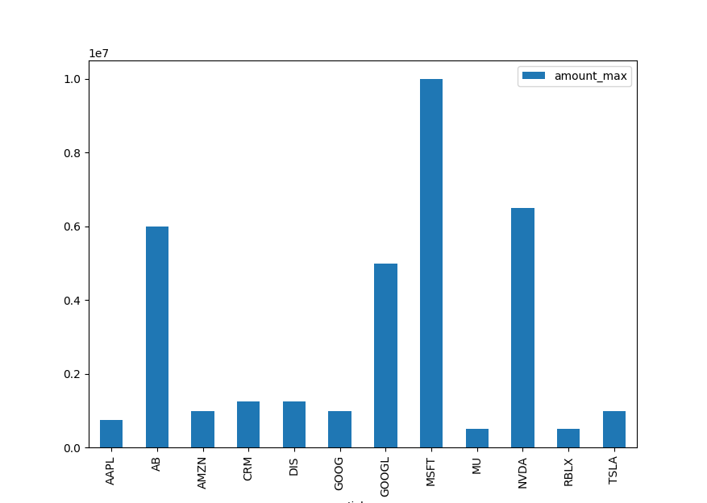

##### Project title:
Stockact

##### Project Description:
This project displays a chart of all stock purchases for individuals required to file Transaction Reports under the Stock Act. The Stock Act was created to combat insider trading by individuals that may or may not have information not available to the public. This allows these individuals to trade legally; however, requires them to post their transactions within 45 days. This project downloads the Financial Disclosure Transaction Reports, parses the data via Grove Manor Software (GMS) parser (will be open sourced soon) or contact us at [gms.dev](https://gms.dev). Then displays a graph to visualize the data file.  

##### First
Use scrape.py to run the function fetch_search_results with the arguments being the last_name and filing year. For example, if I wanted the financial disclosure reports for Nancy Pelosi in year 2021, I would use         
`fetch_search_results('Pelosi', '2021')`
This downloads the Periodic Transaction Reports and saves them as the filing id number.

##### Second
Use GMS parser to render the appropriate data file, our example is "output_pelosi.csv" The parser will be available soon.

##### Third
Use visualize.py to display which stocks were purchased, This uses the max amount to group and sum each ticker. The financial disclosure reports post min and max amounts, visualize.py only sums the max amounts. THESE ARE NOT EXACT AMOUNTS!

# NOTE: This is for python practice only and should NOT be used as financial advice.
